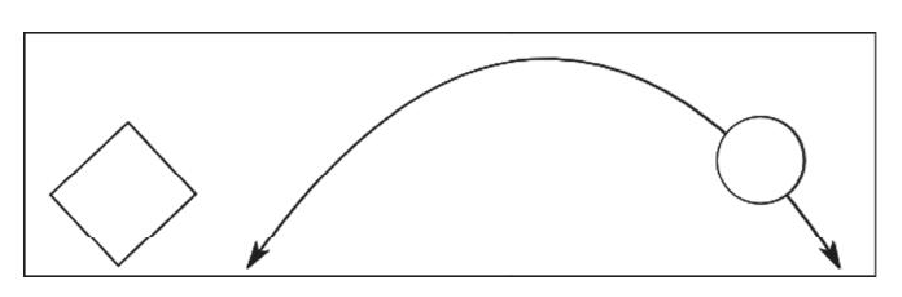

import { Scene} from './04-materials-light-animation.jsx'

如果希望我们的场景动起来，那么首先需要解决的问题是如何在特定的时间间隔重新渲染场景。
在HTML5和相关的JavaScript API出现之前，是通过使用setInterval（function，interval）方法来实现的。
比如，通过setInterval()方法指定某个函数每100毫秒调用一次。
但是这个方法的缺点在于它不管浏览器当前正在发生什么（比如正浏览其他网页），它都会每隔几毫秒执行一次。除此之外，setInterval()方法并没与屏幕的刷新同步。
这将会导致较高的CPU使用率和性能不良。

<Scene/>

### 引入requestAnimationFrame

现代浏览器通过requestAnimationFrame函数为稳定而连续的渲染场景提供了良好的解决方案。
通过这个函数，你可以向浏览器提供一个回调函数。你无须定义回调的间隔，浏览器将自行决定最佳的调用时机。
你需要做的是在这个函数里面完成一帧一帧的绘制操作，剩下的就交给浏览器，它负责绘制尽量高效和平滑画面。

```jsx title='chapter-01/04-materials-light-animation.jsx'
function animate() {
    // render using requestAnimationFrame
    requestAnimationFrame(animate);
    renderer.render(scene, camera);
}
animate();
```

在animate函数中，requestAnimationFrame将会再一次调用animate方法，这样嵌套的调用就可以确保动画持续运行。 
然后将 renderer.render(scene, camera); 方法使用animate函数代替就可启动动画了。

这样运行起来和我们之前没有什么差别，我们还没有给物体添加任何动画。在使动画动起来之前我们先介绍第一个辅助工具。检测动画帧的工具。使用它前需要引用。

```jsx title='docs/init.js'
import Stats from 'three/examples/jsm/libs/stats.module'

export function initStats() {

    var stats = new Stats();

    stats.setMode(0); // 0: fps, 1: ms

    // Align top-left
    stats.domElement.style.position = 'absolute';
    stats.domElement.style.left = '0px';
    stats.domElement.style.top = '0px';

    document.getElementById("Stats-output").appendChild(stats.domElement);

    return stats;
}
```

创建好Stats对象之后，我们将它添加到了Stats-output的元素内。 该元素在我们画布元素中新添加的。
Stats 工具可以帮助我们监控动画的每秒的帧数（青色界面），每渲染一帧花费的时间（绿色），和内存（红色）。 点击界面上的帧监测工具可以切换界面。 

```jsx title='chapter-01/04-materials-light-animation.jsx'
<div
    style={{
    height: 500 ,
    position:'relative'
    }}
    ref={ref}
>
    <div id="Stats-output"></div>
</div>
```

## 旋转立方体

我们配置好了Stats工具之后， 就要扩展 animate 方法，使得红色立方体沿着中心旋转。
```jsx
function animate() {
    ...
    // rotate the cube around its axes
    cube.rotation.x += 0.02;
    cube.rotation.y += 0.02;
    cube.rotation.z += 0.02;
    ...
    // render using requestAnimationFrame
    requestAnimationFrame(animate);
    renderer.render(scene, camera);
}
```
我们只需要将cube的每个轴的rotation属性增加0.02

## 弹跳球

让小球跳动起来在 童谣要在 animate 扩展方法。
```jsx
function animate() {
    ...
    // bounce the sphere up and down
    step += 0.02;
    sphere.position.x = 20 + ( 10 * (Math.cos(step)));
    sphere.position.y = 2 + ( 10 * Math.abs(Math.sin(step)));
    ...
    // render using requestAnimationFrame
    requestAnimationFrame(animate);
    renderer.render(scene, camera);
}
```



球体如果能做出如上的弧线，需要给x，y坐标分别设置不同参数。 先看y坐标的变化，在一个周期内由小到大，可以想到是一个sin函数将x轴下半部分反折上去的函数。
再看x坐标的变化，在一个周期内是增大或者减小的。可以用sin或者cos表示。 两者现在不是一个周期内所以使用cos函数。