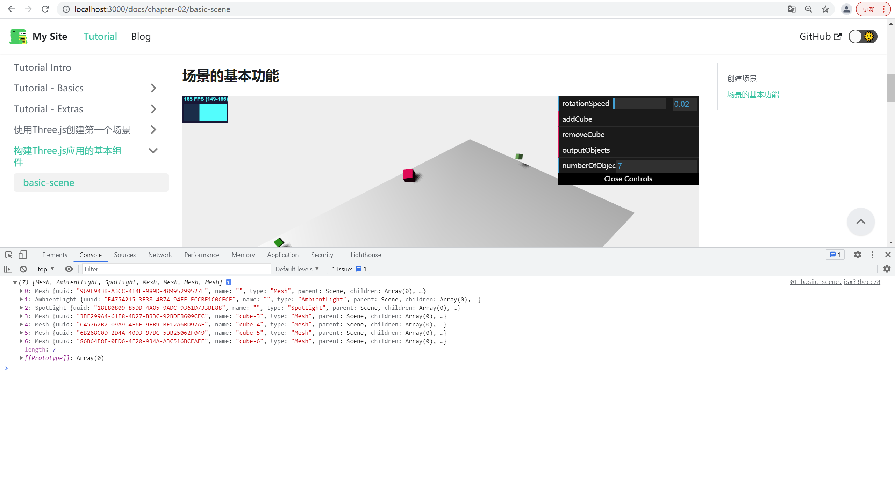

## 创建场景

第一章我们已经创建了一个场景,要想一个场景想要显示任何东西,需要加如下组件.

|组件|说明|
|---|---|
|摄像机|决定屏幕上那些东西要渲染|
|光源|决定材质如何显示及产生阴影|
|对象|主要渲染对象,如方块,球体|
|渲染器|基于摄像机和场景的信息,调用底层图形API执行真正的场景绘制工作|

:::info
THREE.Scene对象有时被称为场景图，可以用来保存所有图形场景的必要信息。在Three.js中，这意味着THREE.Scene保存所有对象、光源和渲染所需的其他对象。场景图(graph)，顾名思义，不仅仅是一个对象数组，还包含了场景图树形结构中的所有节点。每个你添加到Three.js场景的对象，甚至包括THREE.Scene本身，都是继承自一个名为THREE.Object3D的对象。一个THREE.Object3D对象也可以有自己的子对象，你也可以使用它的子对象来创建一个Three.js能解释和渲染的对象树。
:::

## 场景的基本功能
import {  Scene } from './01-basic-scene.jsx';

<Scene/>

<br/>

我们使用Three的Scene对象的add方法,添加了一个Three.Mesh对象(平面),一个Three.SpotLight对象(聚光灯),一个Three.AmbientLight对象(环境光).

通过编写好的控件,我们可以添加一个方框,移除最后一个添加进来的方块,以及在浏览器中显示当前场景中的所有对象.空间区的最后一项显示了当前场景中所有对象的数量.
你可以发现当场景启动的时候有4个对象,平面,两个灯源,一个相机.

我们从addCub开始看起. 
```jsx title='chapter-02/01-basic-scene.jsx'
 this.addCube = function () {

    var cubeSize = Math.ceil((Math.random() * 3));
    var cubeGeometry = new THREE.BoxGeometry(cubeSize, cubeSize, cubeSize);
    var cubeMaterial = new THREE.MeshLambertMaterial({color: Math.random() * 0xffffff});
    var cube = new THREE.Mesh(cubeGeometry, cubeMaterial);
    cube.castShadow = true;
    cube.name = "cube-" + scene.children.length;

    // position the cube randomly in the scene
    cube.position.x = -30 + Math.round((Math.random() * planeGeometry.parameters.width));
    cube.position.y = Math.round((Math.random() * 5));
    cube.position.z = -20 + Math.round((Math.random() * planeGeometry.parameters.height));

    // add the cube to the scene
    scene.add(cube);
    this.numberOfObjects = scene.children.length;
};
```
这段代码的意思就是,每次点击按钮,随机生成一个1,3大小的方块.颜色也是随机的.位置也是随机的.
numberOfObjects对象是在控件中显示当前对象的个数, 增加或者删除对象也要改变对应的个数.

:::info
这段代码里面的新东西是name属性,为方块指定一个名字,给对象命名在调试的时候是很有用的,而且还可以直接通过名称来获取场景中的对象.
如果使用Three.Scene.getObjectByName(name)方法,还是可以直接获取到场景名称为name的对象.
:::


我们再看下remove方法.
```jsx title='chapter-02/01-basic-scene.jsx'
this.removeCube = function () {
    var allChildren = scene.children;
    var lastObject = allChildren[allChildren.length - 1];
    if (lastObject instanceof THREE.Mesh) {
        scene.remove(lastObject);
        this.numberOfObjects = scene.children.length;
    }
};
```
移除最后一个添加的方块对象,我们可以使用Three.Scene对象的children属性来获取最后要给添加到场景中对象,children属性存储了场景中所有对象.
在移除的时候,我们还需要检查该对象是不是THREE.Mesh对象,这样做的原因是避免移除摄像机和光源.当我们移除对象之后,再更新对象总数.


控制台最后一个按钮是输出功能,它会在浏览器的控制台里面输出内容.



这样做对于代码调试非常有用,尤其是当你为对象命名时.它对查找某个特定的对象相关问题非常有用.

```jsx title='chapter-02/01-basic-scene.jsx'
function animate() {
    stats.update();

    // rotate the cubes around its axes
    scene.traverse(function (e) {
        if (e instanceof THREE.Mesh && e != plane) {

            e.rotation.x += controls.rotationSpeed;
            e.rotation.y += controls.rotationSpeed;
            e.rotation.z += controls.rotationSpeed;
        }
    });

    // render using requestAnimationFrame
    requestAnimationFrame(animate);
    renderer.render(scene, camera);
}
```

最后我们再看一个函数traverse.我们可以将一个方法传递给traverse方法,这个方法将会在每个子对象上执行.由于THREE.Scene对象存储的是对象树,如果子对象还有子对象,
traverse方法也会在所有的子对象上执行,直到遍历完场景树中的所有对象.

我们也是使用for或者foreach方法来遍历children属性数组来达到同样的目的,因为scene中的对象并没有发生嵌套.


