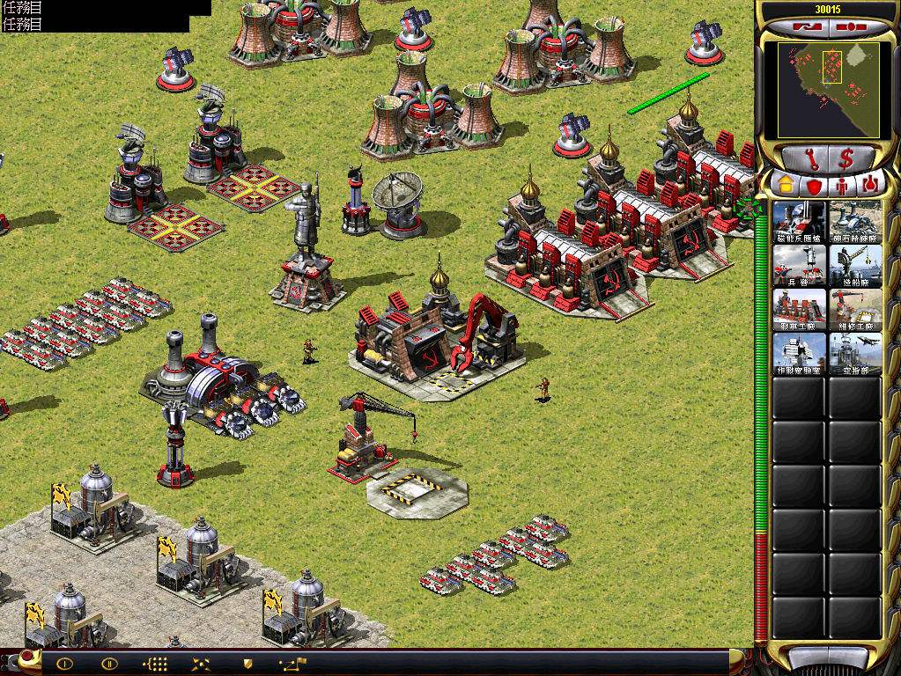
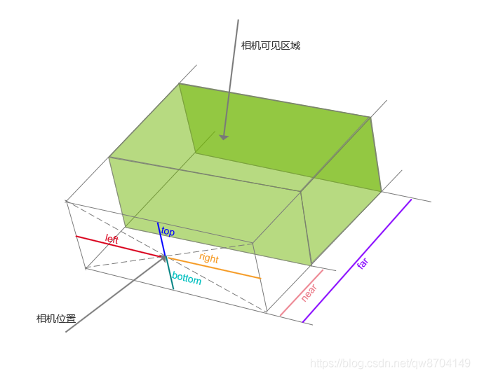

Three.js提供了两种不同的摄像机,正交投影摄像机和透视投影摄像机

import {  Scene } from './07a-both-cameras.jsx';

<Scene/>

<br/>

上面的一开始的画面就是透视投影摄像机,也是最自然的视图。正如你所看到的，这些立方体距离摄像机越远，它们就会被渲染得越小。

当我们切换相机之后,场景就会成另一个展示效果.
使用正交投影摄像机的话，所有的立方体被渲染出来的尺寸都是一样的，因为对象相对于摄像机的距离对渲染的结果是没有影响的。这种摄像机通常被用于二维游戏中.



## 透视投影摄像机(PerspectiveCamera)

import Frustum3d from './assets/frustum-3d.svg';


创建相机参数

|参数|描述|
|---|---|
|fov|视界，从镜头可以看到的场景的部分。其值为镜头到近平面上下边的夹角人眼的FOV接近180度，某些鸟类的FOV打到360度。但是计算机屏幕做不到覆盖视野，通常3D游戏的FOV取值在60-90度之间较好的默认值为45|
|aspect|长宽比:这个是渲染结果输出区域的横向长度和纵向长度的比值；长宽比决定了水平视场和垂直视场之间的比例关系，推荐默认值.window.innerWidth/window.innerHeight|
|near|近面:基于相机位置，表示从这里开始渲染场景；一般会设置一个很小的值，推荐默认值0.1|
|far|远面:基于相机位置，表示停止渲染的位置；要注意设置合适的距离，如果设置太小，部分场景可能渲染不到，但如果设置的太大，会影响渲染的效率，默认值1000|

<Frustum3d width='50%' />

## 正交投影相机(OrthographicCamera)

如果要配置正交投影摄像机，我们需要使用其他的一些属性。由于正交投影摄像机渲染出的物体大小都是一样的，所以它并不关心使用什么长宽比，或者以什么样的视角来观察场景。当使用正交投影摄像机时，你要定义的是一个需要被渲染的方块区域。

创建相机的参数

|参数|描述|
|---|---|
|left|左边界：可渲染部分的左边界|
|right|右边界：可渲染部分的右边界|
|top|上边界：可渲染部分的上边界|
|bottom|下边界：可渲染部分的下边界|
|near|近面：基于相机位置，表示从这里开始渲染场景；一般会设置一个很小的值，默认值0.1|
|far|远面：基于相机位置，表示停止渲染的位置；要注意设置合适的距离，保证场景全部可见，默认值1000|




## 相机帮助助手(CameraHelper))

我们需要更清楚的看到照相机的视野范围.THREE有一个照相机帮助类,此时就需要两个照相机，一个是主照相机，一个是加有辅助线的照相机（有两种，正交和透视，这里辅助的使用的是正交的） 设置两个照相机位置.
注意，辅助的子照相机要在主照相机里面，这样才能在主照相机的镜头下看到辅助照相机的观察范围

import {  Scene as SceneB } from './07b-both-cameras.jsx';

<SceneB />


```jsx title='chapter-02/07b-both-cameras.jsx'
//正交投影照相机
var camera2 = new THREE.PerspectiveCamera(45, div.clientWidth /  div.clientHeight, 10, 1000);
camera2.position.set(120, 60, 180);
camera2.lookAt(0,0,0);

//照相机帮助线
var cameraHelper = new CameraHelper(camera2);
scene.add(cameraHelper);
```