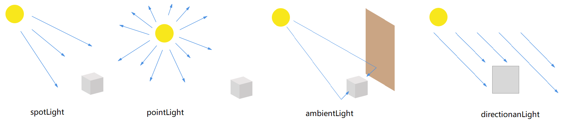

第一章我们学习了Three.js的基础知识. 上一章我们深入了解了场景中中的重要部分,包括几何体,网格,摄像机.
本章我们着重介绍光源,没有光源,渲染的场景将不可见(除非使用基础材质或线框材质).

:::info
WebGL本身并不支持光源.如果不适用Three.js则需要自己写WebGL着色程序来模拟光源.
:::

本章将会学习到以下主题:

* Three.js中可用的光源.
* 特定光源的使用时机.
* 如何调整和配置所有光源的行为.
* 简单的接受如何创建镜头光晕

## Three.js中不同光源

|名称|描述|
|---|---|
|AmbientLight|环境光，其颜色均匀的应用到场景及其所有对象
|PointLight|3D空间中的一个点光源，向所有方向发出光线|
|SpotLight|产生圆锥形光柱的聚光灯，台灯、天花板射灯通常都属于这类光源|
|DirectionalLigh|也就无限光，光线是平行的。典型的例子是日光|
|HemisphereLight|特殊光源，用于创建户外自然的光线效果，此光源模拟物体表面反光效果、微弱发光的天空|
|AreaLight|面光源，指定一个发光的区域|
|LensFlare|不是光源，用于给光源添加镜头光晕效果|

光源可以分为两类,基础光源和特殊用途光源.

基础光源有:AmbientLight, PointLight, SpotLight, DirectionalLigh. 他们几个都继承THREE.Light对象. 只需要简单配置就可以应用于大部分应用场景.
特殊光源有:HemisphereLight,AreaLight,LensFlare. 只有在特殊场景中遇见.

在进入本章内容之前我们先了解下不同光源的不同之处.

